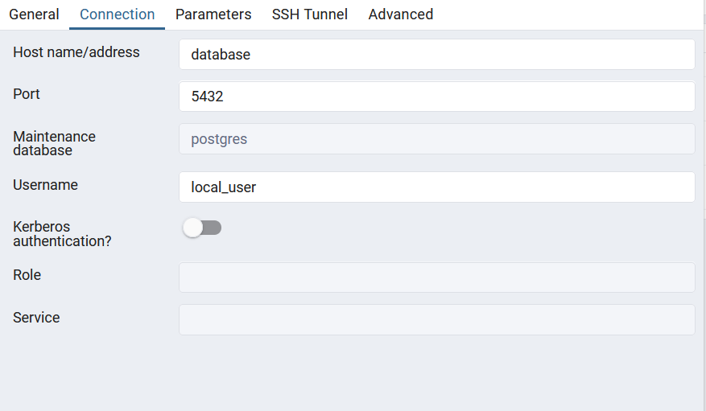

## Requisitos
- [nodeJs@^20.10.0](https://nodejs.org/en/download)
## Instalação
```bash
npm i
# ou
yarn
```

## Iniciar a aplicação
```bash
npm run dev
# ou
yarn run dev
```

## Acessar o PgAdmin
-  http://localhost:1650/browser/
- Credenciais:
  